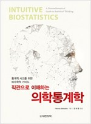
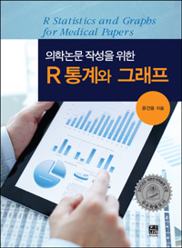
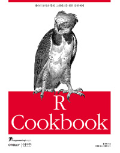

이력서
==========
### 학부
> 이름 : 김도윤  
> 학교 : 한림대학교  
> 학과 : 생명과학/바이오메디컬
--------------  
### 지원분야
> 학과 : 의학과  
> 전공 : 의학유전학
--------------  
### 앞으로 공부할것
>> * 의학 통계학  
    * 의학통계의 기초  
    * 직관으로 이해하는 의학통계학  
      
>> * R  
    * 의학 논문 작성을 위한 R통계     
    * R cookbook  
    * R graphics cookbook  
    * R을이용한 데이터 처리&분석 실무  
       
>> * python
    * python cookbook
------------------
 
  

  
  
  
